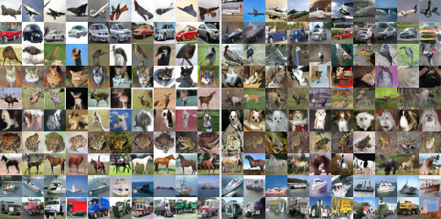
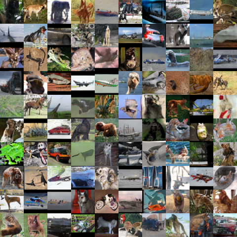

Class-Splitting Generative Adversarial Networks
===============================================

Code for reproducing the experiments with splitting policy.

Full paper: [https://arxiv.org/abs/1709.07359](https://arxiv.org/abs/1709.07359)

This code is heavily based on the excellent work of Ishaan Gulrajani et al. ["Improved Training of Wasserstein GANs"](https://arxiv.org/abs/1704.00028) and his code [https://github.com/igul222/improved_wgan_training](https://github.com/igul222/improved_wgan_training).

Once defined the value for `DATA_DIR`, it should run without problems.

# Some results

Generated images for the supervised CIFAR-10 experiment, with Inception score of 8.87.

Generated images for the unsupervised STL-10 experiment, with Inception score of 9.50.

